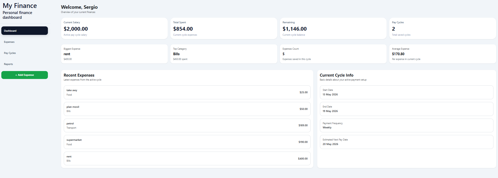
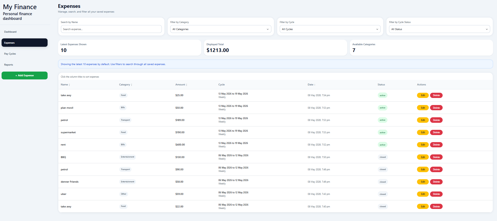
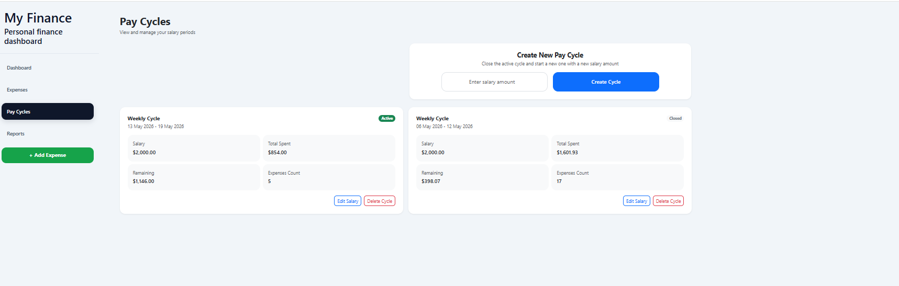
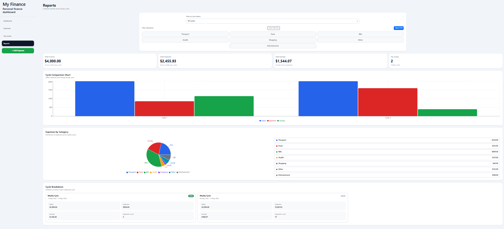
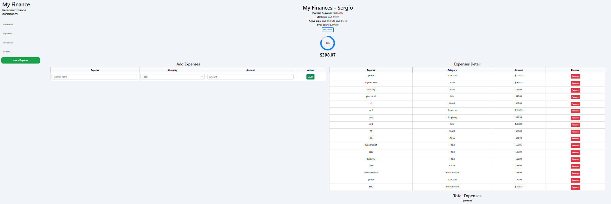

# My Finance

My Finance is a responsive personal finance dashboard built with React.

The application helps users manage their salary, expenses, pay cycles, savings, and financial reports from a simple and organized interface.

This project was created as part of my web development portfolio to demonstrate React, React Router, component-based architecture, localStorage, financial logic, responsive design, filtering, sorting, data visualization, and spreadsheet export functionality.

## Project Preview

My Finance includes a complete dashboard layout with a sidebar, summary cards, expense management, pay cycle control, report charts, spreadsheet export, and an initial setup flow.

The app allows users to create their first salary cycle, track expenses during each pay period, review previous cycles, and generate financial reports based on active and closed cycles.

## Screenshots

### Dashboard



### Expenses



### Pay Cycles



### Reports



### Add Expense



## Main Features

- Create and manage a personal finance profile
- Set an initial payment date
- Choose a payment frequency: weekly, fortnightly, or monthly
- Add a salary amount for the active pay cycle
- Automatically calculate cycle start and end dates
- Add, edit, and delete expenses
- Assign expenses to the current active cycle
- Automatically subtract expenses from the current salary
- View current salary, total spent, remaining balance, and savings
- Display recent expenses on the dashboard
- Track the biggest expense and top spending category
- View active and closed pay cycles
- Create new pay cycles with a new salary amount
- Automatically close the previous cycle when a new one is created
- Restore the previous cycle as active if the current active cycle is deleted
- Reset the setup flow if no pay cycles exist
- Search expenses by name
- Filter expenses by category
- Filter expenses by pay cycle
- Filter expenses by cycle status
- Sort expenses by table columns
- View reports across active and closed cycles
- Display cycle comparison charts
- Display expenses by category
- View detailed cycle breakdowns
- Export financial reports using ExcelJS
- Store all data locally using localStorage
- Responsive layout for desktop and mobile screens

## Technologies Used

- React
- React Router
- JavaScript
- CSS
- Bootstrap
- Vite
- ESLint
- localStorage
- Recharts for data visualization
- ExcelJS for spreadsheet and report export

## Pages Overview

### Dashboard

The Dashboard gives users a quick overview of their current financial situation.

It displays:

- Current salary
- Total spent
- Remaining balance
- Number of saved pay cycles
- Biggest expense
- Top spending category
- Expenses count
- Average expense
- Recent expenses
- Current cycle information

The current cycle section includes the start date, end date, payment frequency, and estimated next pay date.

### Expenses

The Expenses page allows users to manage all saved expenses.

Users can:

- Search expenses by name
- Filter expenses by category
- Filter expenses by pay cycle
- Filter expenses by cycle status
- View the latest expenses
- Check the displayed total
- See available categories
- Sort expenses by table columns
- Edit saved expenses
- Delete saved expenses

If there are no expenses that match the selected filters, the app displays a clear empty state message.

### Pay Cycles

The Pay Cycles page allows users to manage salary periods.

Users can:

- View active and closed cycles
- Create a new pay cycle
- Add a new salary amount
- Edit the salary of an existing cycle
- Delete a cycle
- View salary, total spent, remaining balance, and expense count for each cycle

When a new cycle is created, the previous active cycle is closed and the new one becomes active.

If the active cycle is deleted, the previous cycle can become active again.

If no cycles remain, the app returns to the initial setup flow.

### Reports

The Reports page provides a financial overview across all pay cycles.

It includes:

- Total income
- Total expenses
- Total savings
- Number of visible pay cycles
- Cycle status filter
- Category filter
- Cycle comparison chart
- Expenses by category
- Detailed cycle breakdown
- Spreadsheet export option

The reports use data from both active and closed cycles to give a more complete financial summary.

### Add Expense / Initial Setup

The Add Expense page works as the starting point when the user has no saved cycle.

Users can enter:

- Name
- Initial payment date
- Payment frequency
- Salary amount

After saving the setup, the app creates the first active pay cycle and allows the user to start adding expenses.

Users can then add expenses by entering:

- Expense name
- Category
- Amount

Each expense is linked to the active cycle and is deducted from the available salary.

## Project Structure

```txt
public/
│
└── myfinance.png
│
src/
│
├── components/
│   ├── pages/
│   │   ├── Dashboard.jsx
│   │   ├── Expenses.jsx
│   │   ├── PayCycles.jsx
│   │   ├── Reports.jsx
│   │   ├── AddExpense.jsx
│   │   ├── expenses.css
│   │   └── addExpense.css
│   │
│   ├── Layout.jsx
│   ├── Sidebar.jsx
│   └── SummaryCard.jsx
│
├── utils/
│   ├── expenses.js
│   ├── localStorage.js
│   └── payCycles.js
│
├── App.css
├── App.jsx
├── index.css
└── main.jsx
```

## Data Storage

The application uses localStorage to save data directly in the browser.

Stored data includes:

- User profile information
- Salary
- Expenses
- Pay cycles
- Active and closed cycle status
- Payment frequency
- Start and end dates

Because the project currently uses localStorage, the data is stored only on the user's device and browser.

## Responsive Design

The app was designed to work on different screen sizes.

The dashboard cards, sidebar layout, expense table, pay cycle cards, forms, and report sections were adjusted for desktop and mobile use.

## How to Run the Project

1. Clone the repository:

```bash
git clone https://github.com/your-username/my-finance.git
```

2. Navigate into the project folder:

```bash
cd my-finance
```

3. Install dependencies:

```bash
npm install
```

4. Start the development server:

```bash
npm run dev
```

5. Open the app in the browser:

```txt
http://localhost:5173
```

## Available Scripts

### Run the development server

```bash
npm run dev
```

### Build the project for production

```bash
npm run build
```

### Preview the production build locally

```bash
npm run preview
```

### Run ESLint

```bash
npm run lint
```

## Dependencies

Main dependencies used in this project:

```json
{
  "bootstrap": "^5.3.6",
  "exceljs": "^3.10.0",
  "react": "^19.1.0",
  "react-dom": "^19.1.0",
  "react-router-dom": "^7.14.1",
  "recharts": "^2.15.3"
}
```

## Future Improvements

- Add user authentication
- Connect the app to a backend database
- Add cloud data storage
- Add PDF export
- Improve spreadsheet export formatting
- Add more advanced charts
- Add recurring expenses
- Add budget limits by category
- Add dark mode
- Add unit testing
- Improve accessibility
- Add multi-currency support

## Purpose of the Project

This project was built to practice and demonstrate front-end development skills, including:

- React component structure
- React Router navigation
- State management
- Local data persistence
- Financial calculations
- Conditional rendering
- Filtering and sorting
- Chart-based reporting
- Spreadsheet export
- Responsive design
- Code organization
- Portfolio project presentation

## Author

Created by Sergio Ripetti.